# Tugas 9 Pertemuan 11 - Praktikum Pemrograman Mobile

## 👤 Data Diri

**Nama**: Darrell Gibran  
**NIM**: H1D023060  
**Shift Lama**: F  
**Shift Baru**: A

## 📋 Daftar Isi
- [Deskripsi](#-deskripsi)
- [Fitur Utama](#-fitur-utama)
- [Struktur Aplikasi](#-struktur-aplikasi)
- [Panduan Lengkap Penggunaan](#-panduan-lengkap-penggunaan)
  - [1. Proses Registrasi](#1-proses-registrasi)
  - [2. Proses Login](#2-proses-login)
  - [3. Melihat Daftar Produk](#3-melihat-daftar-produk)
  - [4. Menambah Produk Baru](#4-menambah-produk-baru)
  - [5. Melihat Detail Produk](#5-melihat-detail-produk)
  - [6. Mengubah Data Produk](#6-mengubah-data-produk)
  - [7. Menghapus Produk](#7-menghapus-produk)
  - [8. Logout](#8-logout)
- [Cara Menjalankan](#-cara-menjalankan)
- [Konfigurasi API](#-konfigurasi-api)

---

## 📖 Deskripsi

Aplikasi ini adalah sistem manajemen produk yang dibangun menggunakan Flutter dengan integrasi REST API. Aplikasi memungkinkan pengguna untuk melakukan registrasi, login, dan mengelola data produk (Create, Read, Update, Delete).

## ✨ Fitur Utama

- ✅ **Autentikasi User** - Registrasi dan Login dengan validasi
- ✅ **Manajemen Produk** - CRUD lengkap untuk data produk
- ✅ **Validasi Form** - Validasi input pada setiap form
- ✅ **Token Management** - Penyimpanan token untuk autentikasi
- ✅ **Responsive UI** - Tampilan yang menarik dan user-friendly

## 🏗️ Struktur Aplikasi

```
lib/
├── bloc/                   # Business Logic Component
│   ├── login_bloc.dart
│   ├── registrasi_bloc.dart
│   └── produk_bloc.dart
├── helpers/                # Helper & Utilities
│   ├── api.dart           # HTTP Client
│   ├── api_url.dart       # Endpoint URLs
│   └── user_info.dart     # User Session Management
├── model/                  # Data Models
│   ├── login.dart
│   ├── registrasi.dart
│   └── produk.dart
├── ui/                     # User Interface Pages
│   ├── login_page.dart
│   ├── registrasi_page.dart
│   ├── produk_page.dart
│   ├── produk_detail.dart
│   └── produk_form.dart
├── widget/                 # Reusable Widgets
│   ├── success_dialog.dart
│   └── warning_dialog.dart
└── main.dart              # Entry Point
```

---

## 📱 Panduan Lengkap Penggunaan

### 1. Proses Registrasi

#### a. Mengisi Form Registrasi


**Langkah-langkah:**
1. Dari halaman login, klik link **"Registrasi"** di bagian bawah
2. Isi form dengan data berikut:
   - **Nama**: Minimal 3 karakter
   - **Email**: Format email yang valid
   - **Password**: Minimal 6 karakter
   - **Konfirmasi Password**: Harus sama dengan password

**Kode Validasi Form:**

```dart
// Validasi Nama
Widget _namaTextField() {
  return TextFormField(
    decoration: const InputDecoration(labelText: "Nama"),
    keyboardType: TextInputType.text,
    controller: _namaTextboxController,
    validator: (value) {
      if (value!.length < 3) {
        return "Nama harus diisi minimal 3 karakter";
      }
      return null;
    },
  );
}

// Validasi Email
Widget _emailTextField() {
  return TextFormField(
    decoration: const InputDecoration(labelText: "Email"),
    keyboardType: TextInputType.emailAddress,
    controller: _emailTextboxController,
    validator: (value) {
      if (value!.isEmpty) {
        return 'Email harus diisi';
      }
      // Validasi format email dengan regex
      Pattern pattern = r'^(([^<>()[\]\\.,;:\s@\"]+(\.[^<>()[\]\\.,;:\s@\"]+)*)|(\".+\"))@((\[[0-9]{1,3}\.[0-9]{1,3}\.[0-9]{1,3}\.[0-9]{1,3}\])|(([a-zA-Z\-0-9]+\.)+[a-zA-Z]{2,}))$';
      RegExp regex = RegExp(pattern.toString());
      if (!regex.hasMatch(value)) {
        return "Email tidak valid";
      }
      return null;
    },
  );
}

// Validasi Password
Widget _passwordTextField() {
  return TextFormField(
    decoration: const InputDecoration(labelText: "Password"),
    obscureText: true,
    controller: _passwordTextboxController,
    validator: (value) {
      if (value!.length < 6) {
        return "Password harus diisi minimal 6 karakter";
      }
      return null;
    },
  );
}

// Validasi Konfirmasi Password
Widget _passwordKonfirmasiTextField() {
  return TextFormField(
    decoration: const InputDecoration(labelText: "Konfirmasi Password"),
    obscureText: true,
    validator: (value) {
      if (value != _passwordTextboxController.text) {
        return "Konfirmasi Password tidak sama";
      }
      return null;
    },
  );
}
```

**Penjelasan:**
- Setiap field memiliki validator untuk memastikan data yang diinput valid
- Nama minimal 3 karakter
- Email harus format yang benar (menggunakan regex pattern)
- Password minimal 6 karakter
- Konfirmasi password harus sama dengan password

#### b. Validasi Form Registrasi

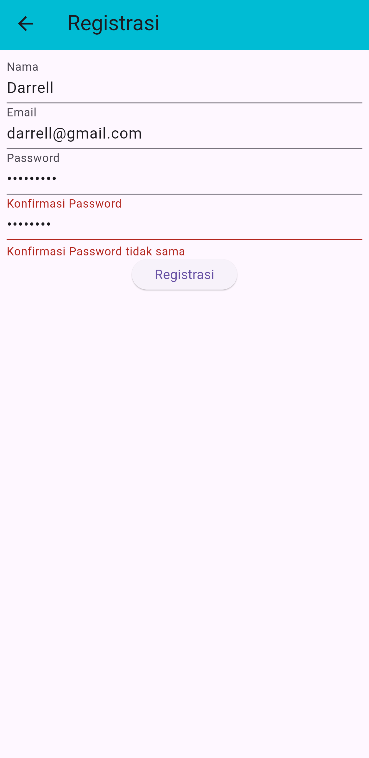

Jika ada field yang tidak memenuhi kriteria, aplikasi akan menampilkan pesan error di bawah masing-masing field. Form tidak bisa di-submit sampai semua validasi terpenuhi.

#### c. Registrasi Berhasil

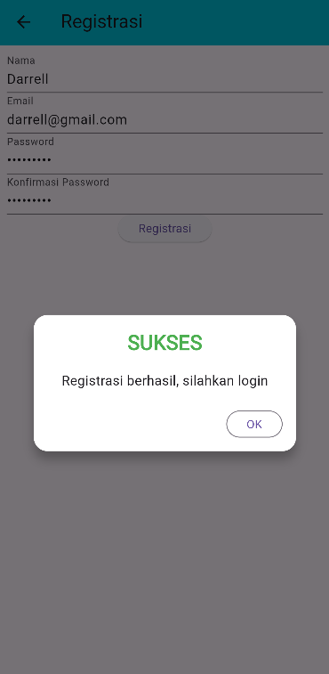

**Proses Submit Registrasi:**

```dart
void _submit() {
  _formKey.currentState!.save();
  setState(() {
    _isLoading = true;
  });
  
  // Memanggil API Registrasi melalui RegistrasiBloc
  RegistrasiBloc.registrasi(
    nama: _namaTextboxController.text,
    email: _emailTextboxController.text,
    password: _passwordTextboxController.text,
  ).then(
    (value) {
      // Jika berhasil, tampilkan dialog sukses
      showDialog(
        context: context,
        barrierDismissible: false,
        builder: (BuildContext context) => SuccessDialog(
          description: "Registrasi berhasil, silahkan login",
          okClick: () {
            Navigator.pop(context); // Kembali ke halaman login
          },
        ),
      );
    },
    onError: (error) {
      // Jika gagal, tampilkan dialog warning
      showDialog(
        context: context,
        barrierDismissible: false,
        builder: (BuildContext context) => const WarningDialog(
          description: "Registrasi gagal, silahkan coba lagi",
        ),
      );
    },
  );
  
  setState(() {
    _isLoading = false;
  });
}
```

**Penjelasan Alur:**
1. Data dari form dikumpulkan dan dikirim ke API backend melalui `RegistrasiBloc`
2. Jika response sukses, muncul dialog **"Registrasi berhasil"**
3. User dapat klik OK untuk kembali ke halaman login
4. Jika gagal (email sudah terdaftar/error server), muncul dialog error

---

### 2. Proses Login

#### a. Mengisi Form Login

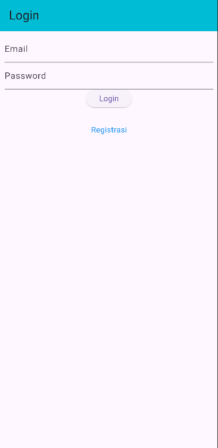

**Langkah-langkah:**
1. Masukkan **Email** yang sudah terdaftar
2. Masukkan **Password**
3. Klik tombol **"Login"**

**Kode Validasi Login:**

```dart
// Validasi Email
Widget _emailTextField() {
  return TextFormField(
    decoration: const InputDecoration(labelText: "Email"),
    keyboardType: TextInputType.emailAddress,
    controller: _emailTextboxController,
    validator: (value) {
      if (value!.isEmpty) {
        return 'Email harus diisi';
      }
      return null;
    },
  );
}

// Validasi Password
Widget _passwordTextField() {
  return TextFormField(
    decoration: const InputDecoration(labelText: "Password"),
    obscureText: true,
    controller: _passwordTextboxController,
    validator: (value) {
      if (value!.isEmpty) {
        return "Password harus diisi";
      }
      return null;
    },
  );
}
```

#### b. Login Gagal

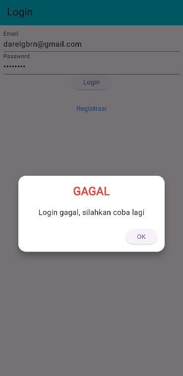

**Proses Login:**

```dart
void _submit() {
  _formKey.currentState!.save();
  setState(() {
    _isLoading = true;
  });
  
  // Memanggil API Login
  LoginBloc.login(
    email: _emailTextboxController.text,
    password: _passwordTextboxController.text,
  ).then(
    (value) async {
      if (value.code == 200) {
        // Login berhasil
        // Simpan token dan user ID ke SharedPreferences
        await UserInfo().setToken(value.token.toString());
        await UserInfo().setUserID(int.parse(value.userID.toString()));
        
        // Navigasi ke halaman produk
        Navigator.pushReplacement(
          context,
          MaterialPageRoute(builder: (context) => const ProdukPage()),
        );
      } else {
        // Login gagal - tampilkan pesan error
        showDialog(
          context: context,
          barrierDismissible: false,
          builder: (BuildContext context) => const WarningDialog(
            description: "Login gagal, silahkan coba lagi",
          ),
        );
      }
    },
    onError: (error) {
      // Error koneksi atau server
      print(error);
      showDialog(
        context: context,
        barrierDismissible: false,
        builder: (BuildContext context) => const WarningDialog(
          description: "Login gagal, silahkan coba lagi",
        ),
      );
    },
  );
  
  setState(() {
    _isLoading = false;
  });
}
```

**Penjelasan Alur:**
1. Email dan password dikirim ke API backend
2. Jika response code = 200 dan credentials benar:
   - Token autentikasi disimpan ke `SharedPreferences` menggunakan `UserInfo()`
   - User ID juga disimpan untuk keperluan request selanjutnya
   - User diarahkan ke halaman daftar produk
3. Jika credentials salah atau ada error, muncul popup **"Login gagal"**

---

### 3. Melihat Daftar Produk

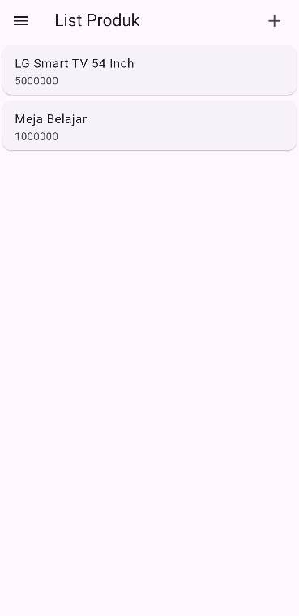

**Fitur pada halaman ini:**
- **AppBar** dengan judul "List Produk"
- **Tombol +** di kanan atas untuk menambah produk baru
- **Hamburger Menu (Drawer)** dengan opsi Logout
- **List Produk** yang dapat diklik untuk melihat detail

**Kode Menampilkan List Produk:**

```dart
class _ProdukPageState extends State<ProdukPage> {
  @override
  Widget build(BuildContext context) {
    return Scaffold(
      appBar: AppBar(
        title: const Text('List Produk'),
        backgroundColor: Colors.cyan,
        actions: [
          Padding(
            padding: const EdgeInsets.only(right: 20.0),
            child: GestureDetector(
              child: const Icon(Icons.add, size: 26.0),
              onTap: () async {
                // Navigasi ke form tambah produk
                Navigator.push(
                  context,
                  MaterialPageRoute(builder: (context) => ProdukForm())
                );
              },
            )
          )
        ],
      ),
      drawer: Drawer(
        child: ListView(
          children: [
            ListTile(
              title: const Text('Logout'),
              trailing: const Icon(Icons.logout),
              onTap: () async {
                // TODO: Implementasi logout
              },
            )
          ],
        ),
      ),
      body: ListView(
        children: [
          ItemProduk(
            produk: Produk(
              id: '1',
              kodeProduk: 'A001',
              namaProduk: 'Kamera',
              hargaProduk: 5000000,
            ),
          ),
          ItemProduk(
            produk: Produk(
              id: '2',
              kodeProduk: 'A002',
              namaProduk: 'Kulkas',
              hargaProduk: 2500000,
            ),
          ),
          // Item produk lainnya...
        ],
      ),
    );
  }
}
```

**Widget Item Produk:**

```dart
class ItemProduk extends StatelessWidget {
  final Produk produk;
  const ItemProduk({Key? key, required this.produk}) : super(key: key);

  @override
  Widget build(BuildContext context) {
    return GestureDetector(
      onTap: () {
        // Navigasi ke halaman detail produk
        Navigator.push(
          context,
          MaterialPageRoute(
            builder: (context) => ProdukDetail(produk: produk)
          )
        );
      },
      child: Card(
        child: ListTile(
          title: Text(produk.namaProduk!),
          subtitle: Text('Rp ${produk.hargaProduk.toString()}'),
        ),
      ),
    );
  }
}
```

**Penjelasan:**
- Setiap produk ditampilkan dalam Card dengan ListTile
- Tap pada item akan membuka halaman detail produk
- Data produk berasal dari API (pada implementasi sebenarnya menggunakan FutureBuilder)

---

### 4. Menambah Produk Baru

#### a. Form Tambah Produk Kosong

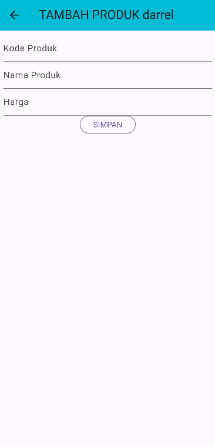

**Langkah-langkah:**
1. Dari halaman daftar produk, klik tombol **+** di AppBar
2. Form tambah produk akan terbuka dengan field kosong

#### b. Validasi Form

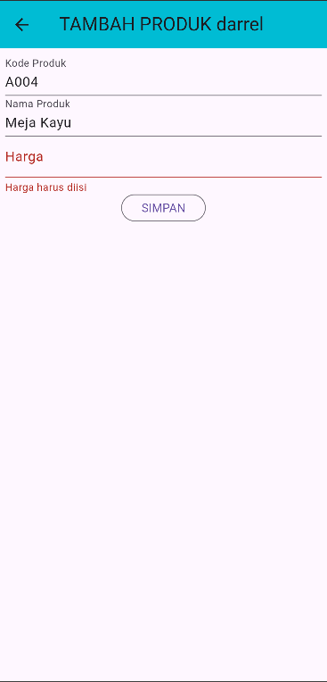

Jika ada field yang kosong atau tidak valid, akan muncul pesan error di bawah field tersebut.

**Kode Validasi Form:**

```dart
Widget _kodeProdukTextField() {
  return TextFormField(
    decoration: const InputDecoration(labelText: "Kode Produk"),
    controller: _kodeProdukTextboxController,
    validator: (value) {
      if (value!.isEmpty) {
        return "Kode Produk harus diisi";
      }
      return null;
    },
  );
}

Widget _namaProdukTextField() {
  return TextFormField(
    decoration: const InputDecoration(labelText: "Nama Produk"),
    controller: _namaProdukTextboxController,
    validator: (value) {
      if (value!.isEmpty) {
        return "Nama Produk harus diisi";
      }
      return null;
    },
  );
}

Widget _hargaProdukTextField() {
  return TextFormField(
    decoration: const InputDecoration(labelText: "Harga"),
    keyboardType: TextInputType.number,
    controller: _hargaProdukTextboxController,
    validator: (value) {
      if (value!.isEmpty) {
        return "Harga harus diisi";
      }
      return null;
    },
  );
}
```

#### c. Mengisi Form

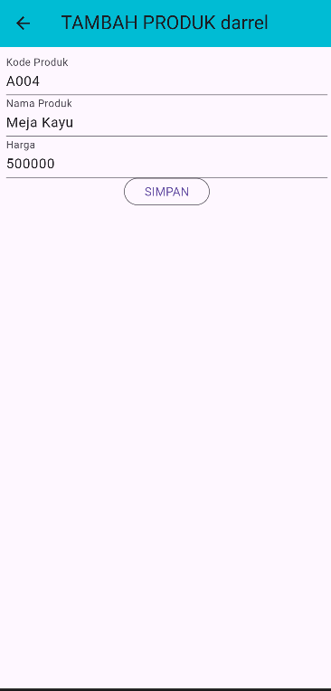

**Proses Simpan Produk:**

```dart
simpan() {
  setState(() {
    _isLoading = true;
  });
  
  // Membuat object Produk baru
  Produk createProduk = Produk(id: null);
  createProduk.kodeProduk = _kodeProdukTextboxController.text;
  createProduk.namaProduk = _namaProdukTextboxController.text;
  createProduk.hargaProduk = int.parse(_hargaProdukTextboxController.text);
  
  // Mengirim data ke API melalui ProdukBloc
  ProdukBloc.addProduk(produk: createProduk).then(
    (value) {
      // Jika berhasil, kembali ke halaman list produk
      Navigator.of(context).push(
        MaterialPageRoute(
          builder: (BuildContext context) => const ProdukPage(),
        ),
      );
    },
    onError: (error) {
      // Jika gagal, tampilkan dialog error
      showDialog(
        context: context,
        builder: (BuildContext context) => const WarningDialog(
          description: "Simpan gagal, silahkan coba lagi",
        ),
      );
    },
  );
  
  setState(() {
    _isLoading = false;
  });
}
```

**Penjelasan Alur:**
1. User mengisi semua field yang required (Kode, Nama, Harga)
2. Data dikumpulkan dalam object `Produk`
3. Object dikirim ke API backend menggunakan method POST
4. Jika berhasil, user diarahkan ke halaman list dan produk baru muncul
5. Jika gagal, muncul dialog error

#### d. Hasil Setelah Tambah Produk


Produk baru **"Laptop"** berhasil ditambahkan dan muncul di daftar produk.

---

### 5. Melihat Detail Produk

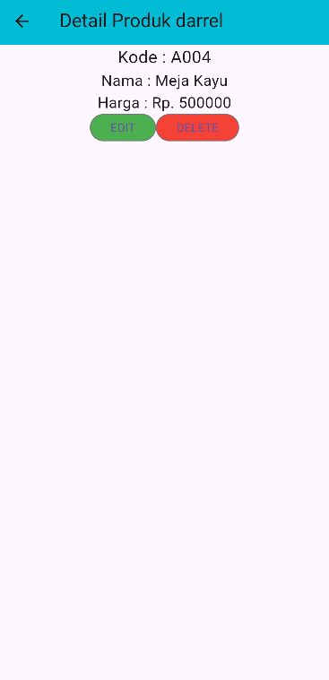

**Fitur pada halaman detail:**
- Menampilkan **Kode Produk**
- Menampilkan **Nama Produk**
- Menampilkan **Harga** dalam format Rupiah
- Tombol **EDIT** (hijau) untuk mengubah data
- Tombol **DELETE** (merah) untuk menghapus data

**Kode Detail Produk:**

```dart
class _ProdukDetailState extends State<ProdukDetail> {
  @override
  Widget build(BuildContext context) {
    return Scaffold(
      appBar: AppBar(
        title: const Text('Detail Produk'),
        backgroundColor: Colors.cyan,
      ),
      body: Center(
        child: Column(
          children: [
            Text(
              "Kode : ${widget.produk!.kodeProduk}",
              style: const TextStyle(fontSize: 20.0),
            ),
            Text(
              "Nama : ${widget.produk!.namaProduk}",
              style: const TextStyle(fontSize: 18.0),
            ),
            Text(
              "Harga : Rp. ${widget.produk!.hargaProduk.toString()}",
              style: const TextStyle(fontSize: 18.0),
            ),
            _tombolHapusEdit()
          ],
        ),
      ),
    );
  }

  Widget _tombolHapusEdit() {
    return Row(
      mainAxisSize: MainAxisSize.min,
      children: [
        // Tombol Edit
        OutlinedButton(
          child: const Text("EDIT"),
          style: OutlinedButton.styleFrom(
            backgroundColor: Colors.green
          ),
          onPressed: () {
            Navigator.push(
              context,
              MaterialPageRoute(
                builder: (context) => ProdukForm(produk: widget.produk!),
              ),
            );
          },
        ),
        // Tombol Hapus
        OutlinedButton(
          child: const Text("DELETE"),
          style: OutlinedButton.styleFrom(
            backgroundColor: Colors.red
          ),
          onPressed: () => confirmHapus(),
        ),
      ],
    );
  }
}
```

**Penjelasan:**
- Data produk diterima dari halaman sebelumnya melalui constructor
- Ditampilkan menggunakan widget `Text`
- Terdapat 2 tombol aksi: Edit dan Delete

---

### 6. Mengubah Data Produk

#### a. Form Edit Produk

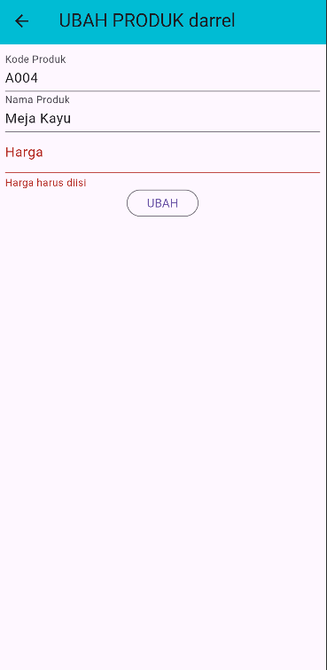

**Langkah-langkah:**
1. Dari halaman detail produk, klik tombol **EDIT**
2. Form akan otomatis terisi dengan data produk yang dipilih
3. Ubah data yang ingin diubah
4. Klik tombol **UBAH**

**Kode Inisialisasi Form Edit:**

```dart
@override
void initState() {
  super.initState();
  isUpdate();
}

isUpdate() {
  if (widget.produk != null) {
    setState(() {
      // Mode EDIT - form terisi data existing
      judul = "UBAH PRODUK";
      tombolSubmit = "UBAH";
      _kodeProdukTextboxController.text = widget.produk!.kodeProduk!;
      _namaProdukTextboxController.text = widget.produk!.namaProduk!;
      _hargaProdukTextboxController.text = widget.produk!.hargaProduk.toString();
    });
  } else {
    // Mode TAMBAH - form kosong
    judul = "TAMBAH PRODUK";
    tombolSubmit = "SIMPAN";
  }
}
```

**Proses Update Produk:**

```dart
ubah() {
  setState(() {
    _isLoading = true;
  });
  
  // Membuat object Produk dengan ID existing
  Produk updateProduk = Produk(id: widget.produk!.id!);
  updateProduk.kodeProduk = _kodeProdukTextboxController.text;
  updateProduk.namaProduk = _namaProdukTextboxController.text;
  updateProduk.hargaProduk = int.parse(_hargaProdukTextboxController.text);
  
  // Mengirim data ke API dengan method PUT
  ProdukBloc.updateProduk(produk: updateProduk).then(
    (value) {
      // Jika berhasil, kembali ke halaman list produk
      Navigator.of(context).push(
        MaterialPageRoute(
          builder: (BuildContext context) => const ProdukPage(),
        ),
      );
    },
    onError: (error) {
      // Jika gagal, tampilkan dialog error
      showDialog(
        context: context,
        builder: (BuildContext context) => const WarningDialog(
          description: "Permintaan ubah data gagal, silahkan coba lagi",
        ),
      );
    },
  );
  
  setState(() {
    _isLoading = false;
  });
}
```

**Penjelasan:**
- Form yang sama (`ProdukForm`) digunakan untuk tambah dan edit
- Jika ada object `Produk` yang dikirim via constructor, berarti mode EDIT
- Data existing ditampilkan di form untuk diubah
- Update menggunakan ID produk yang sudah ada
- Request dikirim ke API dengan method PUT

#### b. Hasil Setelah Edit Produk

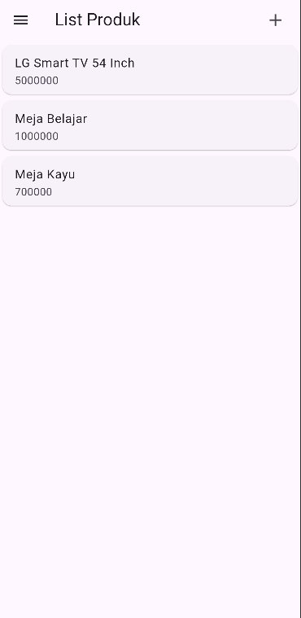

Data produk **"Laptop"** berhasil diubah menjadi **"Laptop Asus"** dan harganya berubah.

---

### 7. Menghapus Produk

#### a. Dialog Konfirmasi Hapus

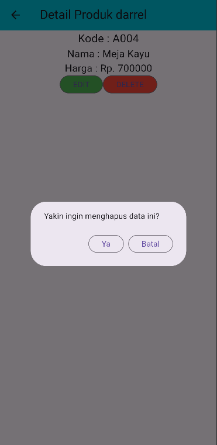

**Langkah-langkah:**
1. Dari halaman detail produk, klik tombol **DELETE**
2. Muncul dialog konfirmasi **"Yakin ingin menghapus data ini?"**
3. Pilih **"Ya"** untuk menghapus atau **"Batal"** untuk membatalkan

**Kode Konfirmasi Hapus:**

```dart
void confirmHapus() {
  AlertDialog alertDialog = AlertDialog(
    content: const Text("Yakin ingin menghapus data ini?"),
    actions: [
      // Tombol Ya - Hapus
      OutlinedButton(
        child: const Text("Ya"),
        onPressed: () {
          // Memanggil API Delete
          ProdukBloc.deleteProduk(id: int.parse(widget.produk!.id!)).then(
            (value) => {
              // Jika berhasil, kembali ke halaman list produk
              Navigator.of(context).push(
                MaterialPageRoute(
                  builder: (context) => const ProdukPage()
                )
              )
            },
            onError: (error) {
              // Jika gagal, tampilkan dialog error
              showDialog(
                context: context,
                builder: (BuildContext context) => const WarningDialog(
                  description: "Hapus gagal, silahkan coba lagi",
                )
              );
            }
          );
        },
      ),
      // Tombol Batal
      OutlinedButton(
        child: const Text("Batal"),
        onPressed: () => Navigator.pop(context),
      )
    ],
  );

  // Tampilkan dialog
  showDialog(builder: (context) => alertDialog, context: context);
}
```

**Penjelasan Alur:**
1. Sebelum menghapus, sistem menampilkan dialog konfirmasi untuk keamanan
2. Jika user klik **"Ya"**:
   - ID produk dikirim ke API dengan method DELETE
   - Jika berhasil, user kembali ke halaman list
   - Produk yang dihapus tidak muncul lagi di daftar
3. Jika user klik **"Batal"**, dialog tertutup dan tidak ada perubahan
4. Jika terjadi error saat delete, muncul dialog error

---

### 8. Logout

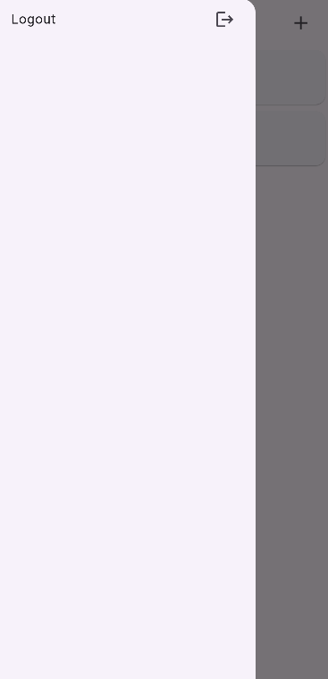

**Langkah-langkah:**
1. Dari halaman list produk, tap **hamburger menu** (3 garis) di kiri atas
2. Klik menu **"Logout"**
3. Session akan dihapus dan user kembali ke halaman login

**Kode Logout (implementasi yang seharusnya):**

```dart
ListTile(
  title: const Text('Logout'),
  trailing: const Icon(Icons.logout),
  onTap: () async {
    // Hapus token dan user ID dari SharedPreferences
    await UserInfo().logout();
    
    // Navigasi ke halaman login
    // Hapus semua route sebelumnya agar user tidak bisa back
    Navigator.of(context).pushAndRemoveUntil(
      MaterialPageRoute(builder: (context) => const LoginPage()),
      (Route<dynamic> route) => false,
    );
  },
)
```

**Penjelasan:**
- Logout akan menghapus semua data session (token dan user ID)
- User diarahkan kembali ke halaman login
- Menggunakan `pushAndRemoveUntil` agar user tidak bisa back ke halaman sebelumnya