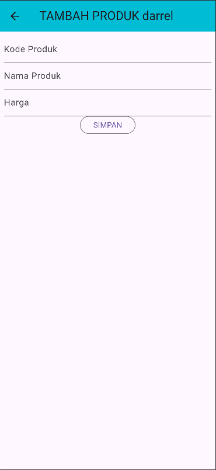
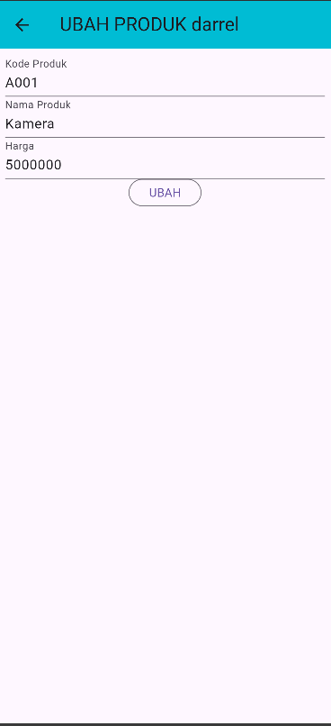

# Tugas 8 Pertemuan 10 - Praktikum Pemrograman Mobile

## Data Diri

Nama        : Darrell Gibran 
NIM         : H1D023060 
Shift Lama  : F 
Shift Baru  : A

## Screenshot Aplikasi

## Penjelasan Halaman

### 1. **main.dart**
Entry point aplikasi yang menjalankan `MyApp` dengan halaman awal `home:{...}`. Menggunakan Material Design dan menonaktifkan debug banner.

### 2. **login_page.dart**
Halaman login dengan form email dan password. Terdapat validasi input dan link navigasi ke halaman registrasi. Form menggunakan `TextFormField` dengan validasi email dan password minimal 6 karakter.

### 3. **registrasi_page.dart**
Halaman registrasi pengguna baru dengan form input nama (min 3 karakter), email (validasi format email), password (min 6 karakter), dan konfirmasi password. Menggunakan `GlobalKey<FormState>` untuk validasi form.

### 4. **produk_page.dart**
Halaman utama yang menampilkan daftar produk dalam `ListView`. Terdapat tombol add (+) di AppBar untuk menambah produk baru, drawer dengan menu logout, dan setiap item produk dapat diklik untuk melihat detail. Saat ini daftar produk masih **hard coded** / data dummy, belum mengambil dari API.

### 5. **produk_detail.dart**
Halaman detail produk yang menampilkan informasi kode, nama, dan harga produk. Terdapat tombol EDIT (hijau) untuk mengubah data produk dan tombol DELETE (merah) untuk menghapus produk. Tombol delete menampilkan dialog konfirmasi sebelum menghapus.

### 6. **produk_form.dart**
Halaman form untuk tambah/ubah produk. Form memiliki 3 input: Kode Produk, Nama Produk, dan Harga Produk. Judul dan tombol berubah otomatis ("TAMBAH PRODUK"/"UBAH PRODUK") tergantung mode edit atau tambah. Menggunakan `initState()` untuk mengisi data saat mode edit.

